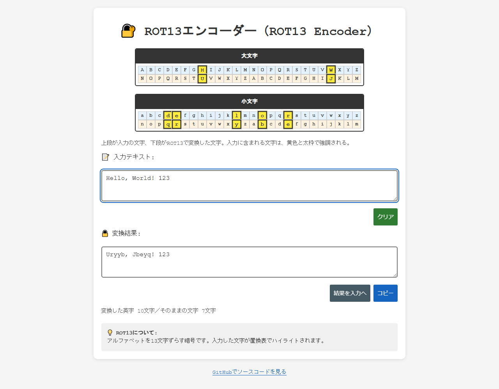
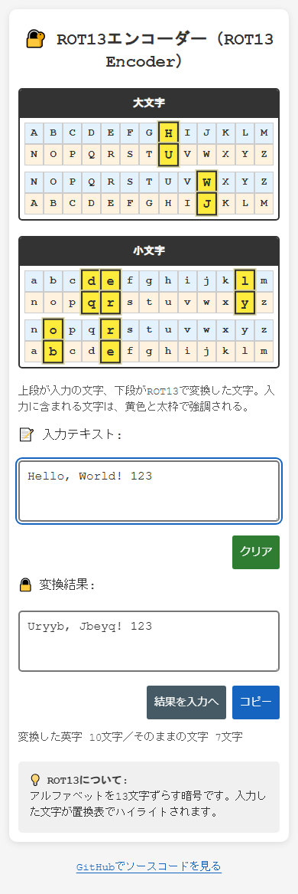
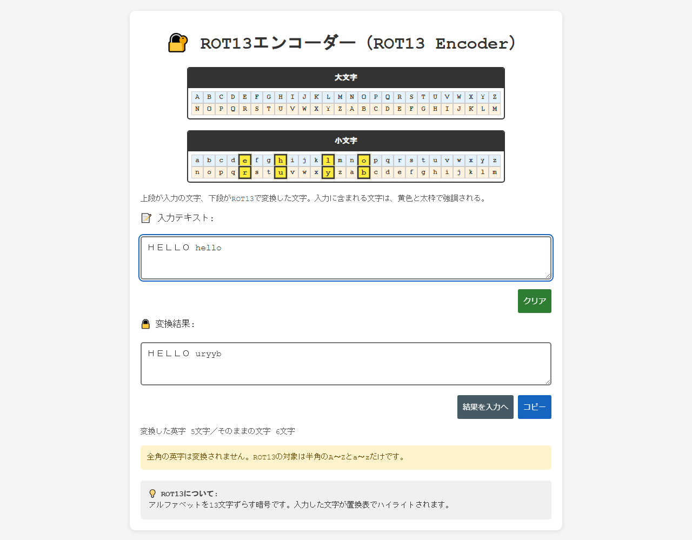
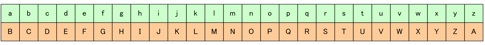
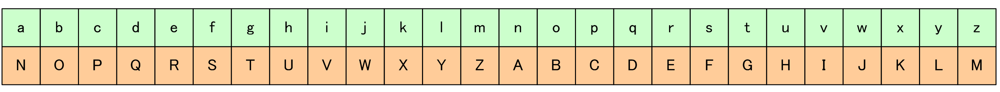
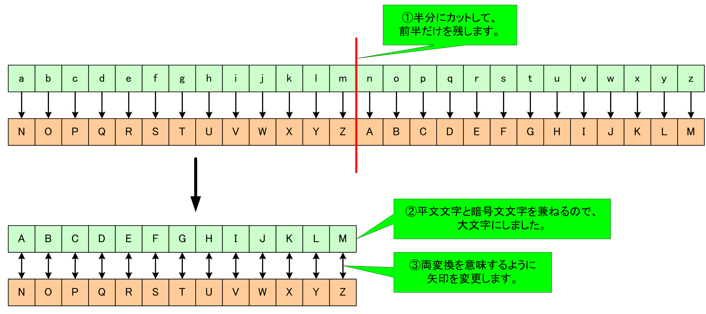
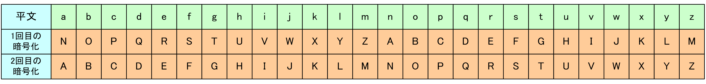

# ROT13 Encoder - Learn the ROT13 cipher with substitution tables

English · [日本語](README.md)


[](https://ipusiron.github.io/rot13-encoder/)

**Day005 - 100 Security Tools with Generative AI**

ROT13 Encoder is an educational cryptography tool that shows how ROT13 (a Caesar cipher with a shift of 13) works.

ROT13 is the friendliest entry point into classical substitution ciphers, and this tool lets you feel it directly: the text is converted as you type, and every letter you use lights up in the substitution tables.

## 🌐 Live demo

👉 [https://ipusiron.github.io/rot13-encoder/](https://ipusiron.github.io/rot13-encoder/)

## 📸 Screenshots

<p align="center">
  
</p>

> *"Hello, World! 123" is converted, and the letters in use are highlighted in yellow with a bold frame.*

<p align="center">
  
</p>

> *At a width of 390px the substitution tables wrap into two rows of 13 columns.*

<p align="center">
  
</p>

> *Only the ASCII letters of "ＨＥＬＬＯ hello" are converted, and a notice explains what happens to full-width letters.*

## ✨ Features

- **Live conversion**: the result is updated on every keystroke
- **Visual substitution tables**: uppercase and lowercase mappings are shown side by side
- **Interactive highlighting**: the columns for the letters in your input are marked in yellow with a bold frame
- **Mobile layout**: below 700px the tables wrap into two rows of 13 columns
- **Result to input**: move the result back into the input box and see that a second pass restores the original text
- **Character counts**: how many letters were converted and how many characters were left alone
- **Full-width notice**: a warning appears when the input contains full-width letters
- **Clear button**: empty the input box in one click
- **Copy button**: copy the result to the clipboard in one click
- **Japanese and English**: switch the interface language from the button in the top right; the choice is remembered in localStorage

## 📖 How to use

### Basic steps

1. **Type**: enter text into the upper text box
2. **Look**: check the highlighted mappings in the substitution tables
3. **Read**: the ROT13 result appears in the lower text box

### Extras

- **Clear**: the green button empties the input and returns focus to it
- **Result to input**: moves the result into the input box and converts again; press it once more and the original text is back
- **Copy**: the blue button copies the result to the clipboard; if the browser denies clipboard access, the result is selected so you can copy it by hand
- **Language**: the button in the top right switches between Japanese and English, and `?lang=en` or `?lang=ja` in the URL selects a language directly

### Examples

| Input | Result | Note |
| --- | --- | --- |
| `Hello World!` | `Uryyb Jbeyq!` | the text shown on first load |
| `Uryyb Jbeyq!` | `Hello World!` | converting twice restores the original |
| `Security Akademeia` | `Frphevgl Nxnqrzrvn` | case is preserved |
| `Hello, World! 123` | `Uryyb, Jbeyq! 123` | digits, symbols and spaces are untouched |
| `The quick brown fox jumps over the lazy dog.` | `Gur dhvpx oebja sbk whzcf bire gur ynml qbt.` | a pangram covering all 26 letters |
| `ＨＥＬＬＯ hello` | `ＨＥＬＬＯ uryyb` | full-width letters are not converted |

### Study hints

- Try words and sentences you already know.
    - For example, "Security Akademeia" becomes "Frphevgl Nxnqrzrvn".
- Convert the same text twice and confirm that you get the original back.
- Open the [Caesar Cipher Wheel](https://github.com/ipusiron/caesar-cipher-wheel) demo, set the shift to 13, and compare it with ROT13.
- Watch which characters stay unchanged, and ask yourself why.

## 📚 Shift ciphers and ROT13

### What a shift cipher is

A shift cipher encrypts text by **moving each letter along the alphabet**.

Because the alphabet wraps around, shift ciphers are often written as ROT, and a shift of n is written ROTn.

A shift of one letter is ROT1, and its substitution table looks like this. The upper row holds the plaintext letters and the lower row the ciphertext letters.



*Substitution table for ROT1*

### What ROT13 is

ROT13 is the case n equals 13, so it is a **shift cipher that moves each letter by 13 places**.
Encryption shifts letters 13 places to the right, and decryption shifts them 13 places to the left.

#### Substitution table

| Case | Input letters | Output letters |
| --- | --- | --- |
| Uppercase | `ABCDEFGHIJKLMNOPQRSTUVWXYZ` | `NOPQRSTUVWXYZABCDEFGHIJKLM` |
| Lowercase | `abcdefghijklmnopqrstuvwxyz` | `nopqrstuvwxyzabcdefghijklm` |



*Substitution table for ROT13*

The alphabet has 26 letters, so shifting 13 places to the right and shifting 13 places to the left give the same result.
Applying a shift of 13 twice therefore lands on the original letter.
In other words, encrypting with ROT13 twice returns the plaintext.



*Letter mapping of ROT13*



*Applying ROT13 twice*

### Where ROT13 is used

ROT13 offers no real secrecy. It is used to hide text temporarily or to make it hard to read at a glance.

- Hiding the answer to a puzzle.
- Hiding content that some readers may find unpleasant.
- Hiding hints about geocaching locations.
    - Geocaching is a worldwide treasure hunt played with GPS or GNSS receivers.
    - [https://www.geocaching.com/](https://www.geocaching.com/)

## ⚠️ Caveats

- ROT13 has no key, so anyone can undo it. Never use it to keep a secret; use a proven cryptographic library instead.
- Only the ASCII letters A-Z and a-z are converted. Full-width letters, accented letters such as é, digits, symbols and Japanese text are left as they are.
- No Unicode normalization is applied, so any string returns to its original form after two passes. In strings that use combining accents, only the ASCII base letters change.

## 🔗 Related tools

- [Day003 Caesar Cipher Wheel](https://github.com/ipusiron/caesar-cipher-wheel): learn the Caesar cipher with a rotating disk for any shift
- [Day004 Japanese Caesar Cipher](https://github.com/ipusiron/japanese-caesar-cipher): a Caesar cipher for hiragana
- [Day008 Caesar Cipher Breaker](https://github.com/ipusiron/caesar-cipher-breaker): break Caesar ciphers by brute force
- [Day037 QuickROT47](https://github.com/ipusiron/quick-rot47): ROT47, which also covers digits and symbols
- [Day051 Involution Studio](https://github.com/ipusiron/involution-studio): a collection of transforms that undo themselves when applied twice

## 🔬 How it is built

### Technology

- **Front end**: HTML5, CSS3, vanilla JavaScript
- **Cipher**: ROT13 (a Caesar cipher with shift 13)
- **Character range**: ASCII A-Z (65-90) and a-z (97-122)
- **Untouched characters**: digits, symbols, spaces, Japanese text, full-width letters and so on
- **Separation of concerns**: `rot13.js` holds the DOM-free logic and `script.js` drives the screen
- **Messages**: `i18n.js` holds the Japanese and English dictionaries, and no display text lives in `script.js`

`rot13.js` exports `rot13` for conversion, `buildTable` for the substitution table, `usedLetters` for the letters in use and `countStats` for the character counts.
It performs no Unicode normalization and never uses the regular expression `i` flag.
That keeps look-alike Unicode characters untouched and preserves the property that two passes restore the original text.

## 🧪 Tests

Run the following command with Node.js 22 or later. No packages need to be installed.

```sh
npm test
```

GitHub Actions runs the same tests on every push and pull request.

- Known answers, character counts, letters in use, and the bijection and symmetry of the substitution table
- All 65,536 UTF-16 code units, checking that two passes restore the original and that only the 52 ASCII letters change
- The examples, substitution table, image references, YAML metadata and site name spelling in the README
- HTML attributes, colour contrast and file formatting
- Matching keys in the Japanese and English dictionaries, consistent placeholders, and the absence of state decided by comparing displayed text

## 🎯 Use cases

### Ways of using this tool in particular

- Confirming the self-inverse transform that returns on a second pass (involution and function classes): ROT13 turns HELLO into URYYB, and a second pass returns HELLO. ROT13 shifts by 13 letters, and 13 twice is 26 and comes back. You can confirm, by passing it twice, that encryption and decryption are the same operation (its own inverse, an involution)
- Confirming that non-letters are unchanged (encoding and character classes): applying ROT13 to `Hello, World 123` changes only the 10 letters and leaves the 6 characters of spaces, punctuation and digits as they are. Of 16 characters, 10 are converted and 6 unchanged. You can confirm that ROT13 acts only on letters, by the converted and unchanged counts
- Confirming that letters 13 apart swap with each other (mapping classes): ROT13 swaps letters 13 apart in the alphabet, such as A with N and B with O. The first 13 letters and the last 13 pair up one to one, and every letter has a fixed partner. You can confirm the round trip of A to N and N to A

### General uses

- Use it as a cover to temporarily hide an answer or a spoiler on a board or a review (anyone who knows the rule can read it)
- Use it as material to learn the difference between encoding and encryption (ROT13 has no key and reverses by the rule alone)
- Use it as a light cipher for puzzles and games

## 🔒 Security and privacy

Nothing is sent over the network and no input is stored.
The only value kept in localStorage is the selected language, and no cookies are used.
Values are written through `textContent` and `value`, never as HTML.
Input is not escaped, trimmed, normalized or truncated.

A Content Security Policy and `no-referrer` are set with meta tags.
`frame-ancestors` cannot be set from a meta tag, so it is not included.

## 📁 Directory layout

```text
rot13-encoder/
├── index.html                 # screen and accessibility attributes
├── styles.css                 # colours and the 13x2 mobile layout
├── script.js                  # DOM handling in the ROT13Encoder class
├── rot13.js                   # DOM-free conversion and counting
├── i18n.js                    # Japanese and English messages
├── README.md                  # Japanese README
├── README.en.md               # this file
├── CLAUDE.md                  # notes for developers
├── LICENSE                    # MIT licence
├── package.json               # test command with no dependencies
├── .github/workflows/
│   └── test.yml               # automated tests on Node.js 22
├── test/
│   ├── rot13.test.js          # known answers and involution over all code units
│   ├── readme.test.js         # documentation checked against the implementation
│   ├── html.test.js           # static checks on the HTML and DOM handling
│   ├── contrast.test.js       # text and non-text contrast
│   ├── i18n.test.js           # dictionaries, markup keys and language switching
│   └── format.test.js         # line counts and line lengths
├── assets/
│   ├── screenshot.png        # desktop view
│   ├── screenshot2.png       # mobile view
│   └── screenshot3.png       # full-width notice
├── rot1_tikanhyou.png         # substitution table for ROT1
├── rot13_tikanhyou.png        # substitution table for ROT13
├── rot13_mapping.png         # letter mapping of ROT13
├── rot13_and_rot13.png        # applying ROT13 twice
└── sample.png                 # older screenshot kept for reference
```

## 💻 Requirements

Recent versions of Chrome, Edge, Firefox and Safari are supported.
Opening `index.html` directly over `file://` also works.
Where clipboard access is denied, copy the selected result by hand.
Running the tests requires Node.js 22 or later.

## 📄 Licence

This project is released under the [MIT licence](./LICENSE).

## 🛠️ About this tool

This tool was built as part of the project "100 Security Tools with Generative AI", in which a security-related tool is created and published every day for 100 days with the help of generative AI.

For the project and the other tools, see the page below.

🔗 [https://akademeia.info/?page_id=42163](https://akademeia.info/?page_id=42163)
