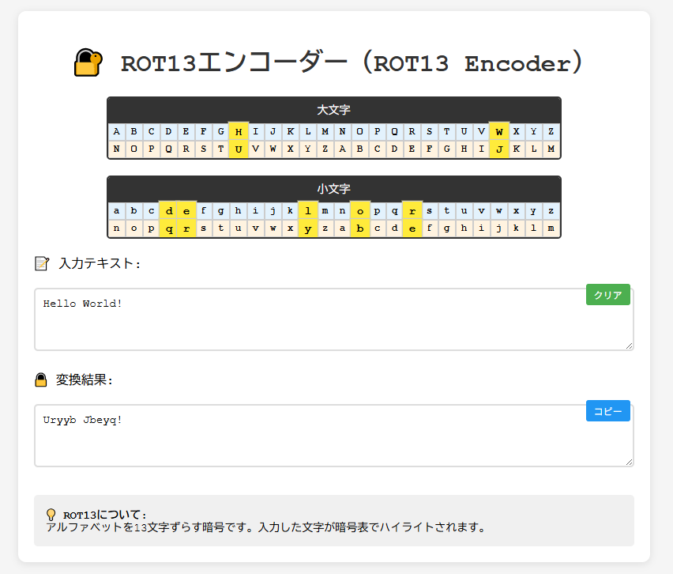
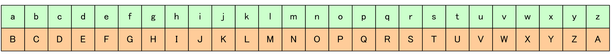
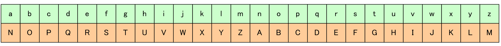
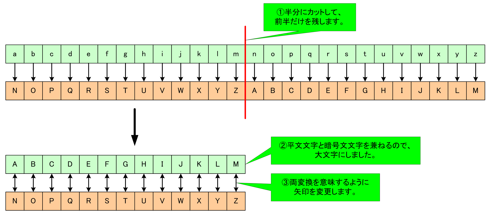
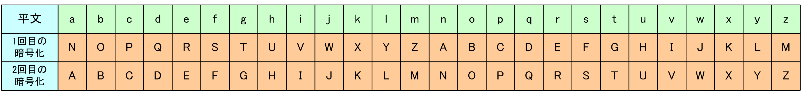

# ROT13エンコーダー（ROT13 Encoder）

**Day 5 - セキュリティツールをAIで作ってみよう 100日チャレンジ**

## 📋 プロジェクト概要

ROT13（Caesar cipher with shift 13）の動作原理を視覚的に学習できる教育用暗号ツールです。

古典暗号の入門として最適な換字式暗号であるROT13を、リアルタイム変換とインタラクティブな置換表で体験できます。

## 🌐 デモページ

👉 [https://ipusiron.github.io/rot13-encoder/](https://ipusiron.github.io/rot13-encoder/)

## 📸 スクリーンショット

*ROT13エンコーダーの動作画面*

## 🎯 100日チャレンジについて

このツールは**[「セキュリティツールをAIで作ってみよう 100日チャレンジ」プロジェクト](https://akademeia.info/?page_id=42163)**の一環として、AI（Claude＋ChatGPT等）の力を借りて開発されました。

セキュリティ教育に役立つ実用的なツールを日々作成し、暗号技術やセキュリティの理解を深めることを目的としています。

## シフト暗号

## 📚 シフト暗号とROT13

### シフト暗号とは

シフト暗号は、**文字ずらしに基づく暗号**です。

シフト暗号はその循環性から、しばしばROTと表現されます。
n文字シフトした場合は、ROTnと表記します。

たとえば、1文字をシフトする暗号はROT1と表記され、その置換表は次のとおりです。
上側が平文文字、下側が暗号文文字になります。

*ROT1の置換表*

### ROT13とは

ROT13はn=13であり、**13文字ずらしのシフト暗号**です。
暗号化では文字を右に13文字シフトし、復号では左に13文字シフトします。

*ROT13の置換表*

アルファベットが26文字あるため、「右に13文字シフトすること」と「左に13文字シフトすること」は同じ結果をもたらします。
これにより、右に13文字シフトを2回繰り返すと、元の文字列と一致します。
つまり、ROT13で2回暗号化すると、元の文字列である平文に戻ります。

*ROT13の文字対応*

*ROT13を2回実行*

### ROT13の用途

ROT13は本格的な秘匿性を提供するものではなく、主にネタバレ防止のために、文字列を一時的に隠したり、読みにくくしたりするために使用されます。

 - パズルの答えを一見してわからなくする。
 - 投稿時に他人を不快にさせる可能性がある内容を隠す。
 - ジオキャッシング（geocaching）の場所に関するヒントを隠す。
  - ジオキャッシングとは、GPSまたはGNSSを利用した地球規模の宝探しゲームのこと。
  - [https://www.geocaching.com/](https://www.geocaching.com/)

### セキュリティ上の注意
**重要**: ROT13は教育目的の暗号であり、実際のセキュリティ用途には使用できません。現代の暗号化には適切な暗号化ライブラリを使用してください。

### もっと学びたい方へ

シフト暗号やROT13の詳細については、拙著[『シーザー暗号の解読法』](https://akademeia.info/?page_id=37037)を参照してください。

## ✨ 主な機能

### 🔧 核心機能
- **リアルタイム変換**: 入力と同時にROT13変換を実行
- **ビジュアル置換表**: 大文字・小文字の対応関係を一目で確認
- **インタラクティブハイライト**: 入力文字とその対応をリアルタイム表示
- **対称性の確認**: 同じ操作で暗号化・復号が可能

### 🛠️ ユーティリティ機能
- **クリアボタン**: 入力テキストの一括削除
- **コピーボタン**: 変換結果をワンクリックでクリップボードにコピー
- **レスポンシブデザイン**: PC・タブレット・スマートフォン対応

## 🚀 使い方

### 基本操作
1. **入力**: 上部のテキストエリアに変換したい文字を入力
2. **確認**: 置換表で対応関係をハイライト表示で確認
3. **結果**: 下部のテキストエリアにROT13変換結果を表示

### 便利機能
- **クリア**: 緑色の「クリア」ボタンで入力をリセット
- **コピー**: 青色の「コピー」ボタンで変換結果をクリップボードへ

### 学習のヒント
- 身近な単語や文章で試してみよう。
  - 例：「Security Akademeia」→「Frphevgl Nxnqrzvn」
- 同じテキストを2回変換すると元に戻ることを確認する。
- [シーザー暗号円盤ツール](https://github.com/ipusiron/caesar-cipher-wheel)のデモページでShiftに13を設定して、ROT13の挙動と比較する。
- 数字や記号は変換されないことを観察する。

## 🔧 技術仕様

### 実装技術
- **フロントエンド**: HTML5, CSS3, Vanilla JavaScript
- **暗号化方式**: ROT13 (Caesar cipher, shift=13)
- **文字対応**: ASCII A-Z (65-90), a-z (97-122)
- **非対象文字**: 数字、記号、空白、日本語文字

### ブラウザ対応
- Chrome 80+
- Firefox 74+
- Safari 13+
- Edge 80+

## 📄 ライセンス

このプロジェクトはMITライセンスの下で公開されています。
教育目的での自由な利用・改変・再配布が可能です。

---

**🔥 100日チャレンジ進行中！** セキュリティツール開発の旅を追いかけたい方は [@ipusiron](https://x.com/ipusiron) をフォローしてください。
