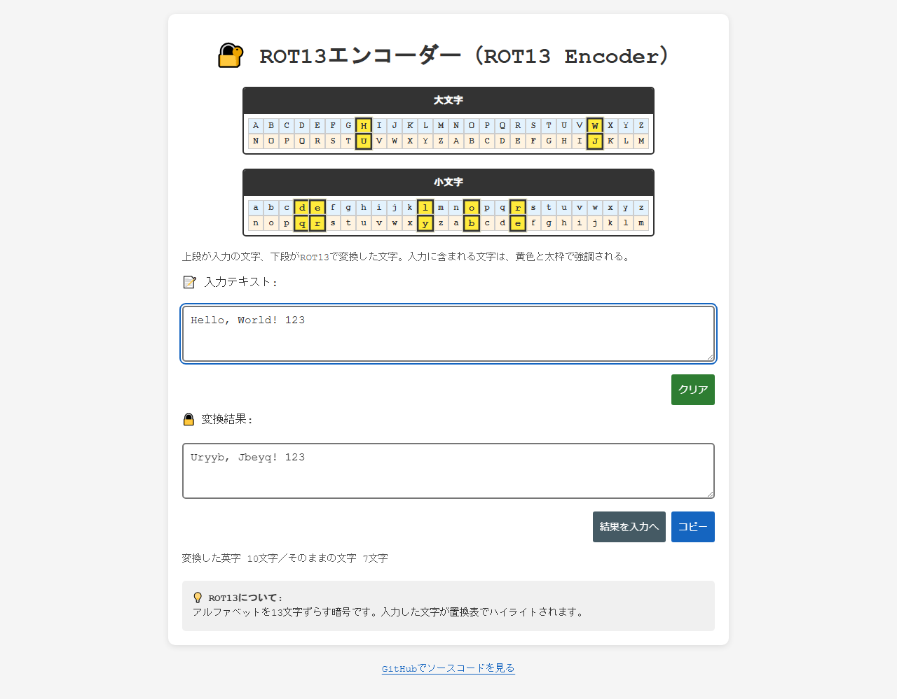
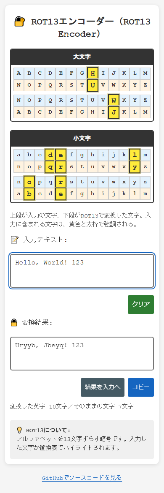
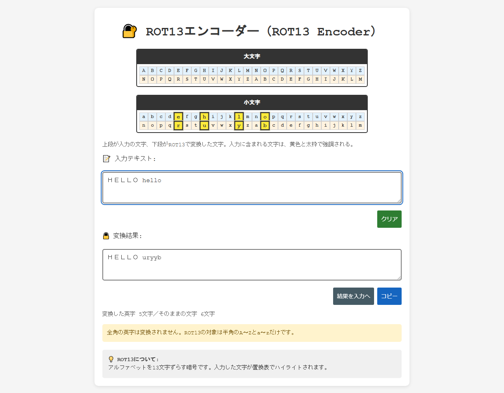
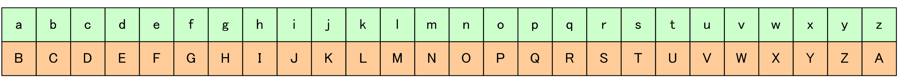
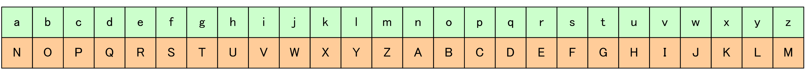
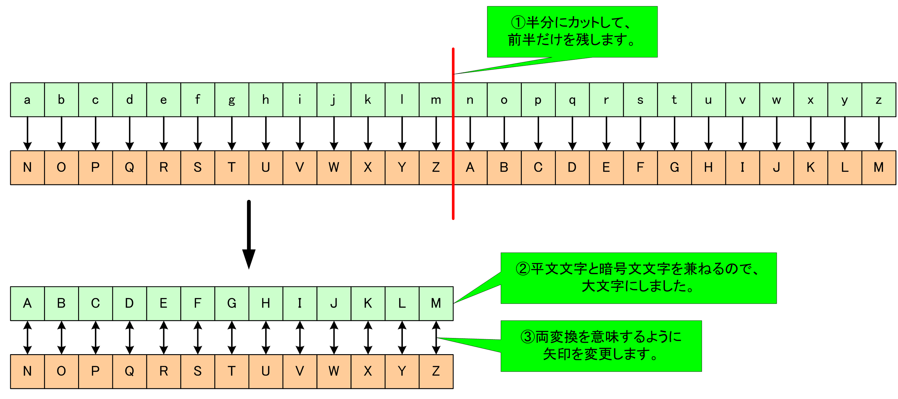
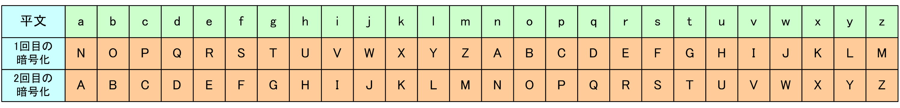

<!--
---
id: day005
slug: rot13-encoder

title: "ROT13 Encoder"

subtitle_ja: "インタラクティブな置換表で学ぶROT13暗号"
subtitle_en: "Learn ROT13 cipher with interactive substitution tables"

description_ja: "ROT13（13文字シフト暗号）の動作原理を視覚的に学習できる教育用暗号ツール。リアルタイム変換とインタラクティブな置換表で古典暗号を体験できます。"
description_en: "An educational cryptography tool for visually learning how ROT13 (13-character shift cipher) works. Experience classical cryptography with real-time conversion and interactive substitution tables."

category_ja:
  - 古典暗号
  - 換字式暗号
category_en:
  - Classical Cryptography
  - Substitution Cipher

difficulty: 1

tags:
  - rot13
  - caesar-cipher
  - shift-cipher
  - cryptography
  - encoder
  - decoder
  - substitution-cipher

repo_url: "https://github.com/ipusiron/rot13-encoder"
demo_url: "https://ipusiron.github.io/rot13-encoder/"

hub: true
---
-->

# ROT13 Encoder - 置換表で学ぶROT13暗号ツール


[](https://ipusiron.github.io/rot13-encoder/)

**Day005 - 生成AIで作るセキュリティツール100**

ROT13（Caesar cipher with shift 13）の動作原理を視覚的に学習できる教育用暗号ツールです。

古典暗号の入門として最適な換字式暗号であるROT13を、リアルタイム変換とインタラクティブな置換表で体験できます。

## 🌐 デモページ

👉 [https://ipusiron.github.io/rot13-encoder/](https://ipusiron.github.io/rot13-encoder/)

## 📸 スクリーンショット



> *「Hello, World! 123」を変換し、対応する文字を黄色と太枠で強調しています。*



> *幅390pxでは、置換表を13列×2段に折り返して表示します。*



> *「ＨＥＬＬＯ hello」の半角英字だけを変換し、全角英字についての注意を表示します。*

## ✨ 機能

- **リアルタイム変換**：入力と同時にROT13変換を実行
- **ビジュアル置換表**：大文字と小文字の対応関係を表示
- **インタラクティブハイライト**：入力に含まれる文字の列を黄色と太枠で強調
- **モバイル表示**：幅700px以下では置換表を13列×2段に折り返し
- **結果を入力へ**：2回変換すると元に戻ることをボタン操作で確認
- **文字数の表示**：変換した英字とそのままの文字の数を表示
- **全角英字の注意**：全角の英字が含まれる場合に注意を表示
- **クリアボタン**：入力テキストの一括削除
- **コピーボタン**：変換結果をワンクリックでクリップボードにコピー

## 📖 使い方

### 基本操作

1. **入力**：上部のテキストエリアに変換したい文字を入力
2. **確認**：置換表で対応関係をハイライト表示で確認
3. **結果**：下部のテキストエリアにROT13変換結果を表示

### 便利機能

- **クリア**：緑色の「クリア」ボタンで入力をリセットし、入力欄にフォーカスを戻す
- **結果を入力へ**：変換結果を入力欄へ移して再変換し、もう一度押すと入力が元に戻る
- **コピー**：青色の「コピー」ボタンで変換結果をクリップボードへ。コピーできない場合は、選択された変換結果を手動でコピーする

### 変換例

| 入力 | 変換結果 | ポイント |
| --- | --- | --- |
| `Hello World!` | `Uryyb Jbeyq!` | 初期表示の例 |
| `Uryyb Jbeyq!` | `Hello World!` | もう一度変換すると元に戻る |
| `Security Akademeia` | `Frphevgl Nxnqrzrvn` | サイト名の例。大文字は大文字、小文字は小文字に変換される |
| `Hello, World! 123` | `Uryyb, Jbeyq! 123` | 数字・記号・空白は変換されない |
| `The quick brown fox jumps over the lazy dog.` | `Gur dhvpx oebja sbk whzcf bire gur ynml qbt.` | a〜zの26文字をすべて含む文 |
| `ＨＥＬＬＯ hello` | `ＨＥＬＬＯ uryyb` | 全角の英字は変換されない |

### 学習のヒント

- 身近な単語や文章で試す。
    - 例：「Security Akademeia」→「Frphevgl Nxnqrzrvn」
- 同じテキストを2回変換すると元に戻ることを確認する。
- [シーザー暗号円盤ツール](https://github.com/ipusiron/caesar-cipher-wheel)のデモページでShiftに13を設定して、ROT13の挙動と比較する。
- 数字や記号は変換されないことを観察する。

## 📚 シフト暗号とROT13

### シフト暗号とは

シフト暗号は、**文字ずらしに基づく暗号**です。

シフト暗号はその循環性から、しばしばROTと表現されます。
n文字シフトした場合は、ROTnと表記します。

たとえば、1文字をシフトする暗号はROT1と表記され、その置換表は次のとおりです。
上側が平文文字、下側が暗号文文字になります。



*ROT1の置換表*

### ROT13とは

ROT13はn=13であり、**13文字ずらしのシフト暗号**です。
暗号化では文字を右に13文字シフトし、復号では左に13文字シフトします。

#### 置換表

| 種類 | 入力の文字 | 変換後の文字 |
| --- | --- | --- |
| 大文字 | `ABCDEFGHIJKLMNOPQRSTUVWXYZ` | `NOPQRSTUVWXYZABCDEFGHIJKLM` |
| 小文字 | `abcdefghijklmnopqrstuvwxyz` | `nopqrstuvwxyzabcdefghijklm` |



*ROT13の置換表*

アルファベットが26文字あるため、「右に13文字シフトすること」と「左に13文字シフトすること」は同じ結果をもたらします。
これにより、右に13文字シフトを2回繰り返すと、元の文字列と一致します。
つまり、ROT13で2回暗号化すると、元の文字列である平文に戻ります。



*ROT13の文字対応*



*ROT13を2回実行*

### ROT13の用途

ROT13は本格的な秘匿性を提供するものではなく、主にネタバレ防止のために、文字列を一時的に隠したり、読みにくくしたりするために使用されます。

- パズルの答えを一見してわからなくする。
- 投稿時に他人を不快にさせる可能性がある内容を隠す。
- ジオキャッシング（geocaching）の場所に関するヒントを隠す。
    - ジオキャッシングとは、GPSまたはGNSSを利用した地球規模の宝探しゲームのこと。
    - [https://www.geocaching.com/](https://www.geocaching.com/)

### もっと学びたい方へ

シフト暗号やROT13の詳細については、拙著[『シーザー暗号の解読法』](https://akademeia.info/?page_id=37037)を参照してください。

## ⚠️ 注意点

- ROT13には鍵がなく、誰でも元に戻せるため、秘密を守る用途には使えない。実際の暗号化には実績のある暗号ライブラリーを使う。
- 変換対象は半角のA〜Zとa〜zだけである。全角の英字、アクセント付きの文字（éなど）、数字、記号、日本語はそのまま残る。
- Unicodeの正規化をしないため、どんな文字列でも2回変換すれば元に戻る。結合アクセントを使う文字列では、基底文字のASCII英字だけが変換される。

## 🔗 関連ツール

- [Day003 Caesar Cipher Wheel](https://github.com/ipusiron/caesar-cipher-wheel)：任意のシフト数のシーザー暗号を円盤で学ぶツール
- [Day004 Japanese Caesar Cipher](https://github.com/ipusiron/japanese-caesar-cipher)：ひらがなのシーザー暗号ツール
- [Day008 Caesar Cipher Breaker](https://github.com/ipusiron/caesar-cipher-breaker)：シーザー暗号の総当たり解読ツール
- [Day037 QuickROT47](https://github.com/ipusiron/quick-rot47)：数字と記号も対象にするROT47ツール
- [Day051 Involution Studio](https://github.com/ipusiron/involution-studio)：2回かけると元に戻る変換（インボリューション）をまとめて体験するツール

## 🔬 技術的な説明

### 実装技術

- **フロントエンド**：HTML5、CSS3、Vanilla JavaScript
- **暗号化方式**：ROT13（Caesar cipher、shift=13）
- **文字対応**：ASCIIのA〜Z（65〜90）、a〜z（97〜122）
- **変換対象外の文字**：数字、記号、空白、日本語、全角の英字など
- **ロジックの分離**：DOMに依存しない`rot13.js`と、画面を操作する`script.js`

`rot13.js`は、変換する`rot13`、置換表を作る`buildTable`、使用文字を集める`usedLetters`、文字数を数える`countStats`を公開します。
Unicodeの正規化はせず、正規表現のiフラグも使用しません。
これにより、ASCII英字に似た別のUnicode文字を変換せず、2回変換すると元に戻る性質を保ちます。

## 🧪 テスト

Node.js 22以上で、次のコマンドを実行します。
依存パッケージのインストールは不要です。

```sh
npm test
```

GitHub Actionsでも、pushとpull requestの際に自動実行します。

- 既知解答、文字数、使用文字、置換表の全単射と対称性を検証
- 全UTF-16コード単位65,536個について、2回変換すると元に戻り、変わるのはASCII英字52個だけであることを検証
- READMEの変換例、置換表、画像参照、YAMLメタデータ、サイト名の綴りを検証
- HTMLの属性、配色のコントラスト、ファイルの整形を検証

## 🔒 セキュリティ・プライバシー

変換処理のための通信は行わず、入力内容は保存しません。
localStorageやCookieも使用しません。
値は`textContent`と`value`にだけ入れ、HTMLとして解釈させません。
入力のエスケープ、trim、Unicodeの正規化、文字数の切り詰めは行いません。

metaタグでCSPと`no-referrer`を設定しています。
`frame-ancestors`はmetaタグでは指定できないため、含めていません。

## 📁 ディレクトリー構造

```text
rot13-encoder/
├── index.html                 # 画面とアクセシビリティ設定
├── styles.css                 # 配色と13列×2段のモバイル表示
├── script.js                  # ROT13EncoderクラスによるDOM処理
├── rot13.js                   # DOMに依存しない変換と集計
├── README.md                  # 使い方と暗号の解説
├── CLAUDE.md                  # 開発者向けの説明
├── LICENSE                    # MITライセンス
├── package.json               # 依存なしのテストコマンド
├── .github/workflows/
│   └── test.yml               # Node.js 22の自動テスト
├── test/
│   ├── rot13.test.js          # 既知解答と全コード単位の対合
│   ├── readme.test.js         # 文書と実装の照合
│   ├── html.test.js           # HTMLとDOM処理の静的検証
│   ├── contrast.test.js       # 文字と非テキストのコントラスト
│   └── format.test.js         # 行数と行長の検証
├── assets/
│   ├── screenshot.png        # デスクトップ表示
│   ├── screenshot2.png       # モバイル表示
│   └── screenshot3.png       # 全角英字の注意表示
├── rot1_tikanhyou.png         # ROT1の置換表
├── rot13_tikanhyou.png        # ROT13の置換表
├── rot13_mapping.png         # ROT13の文字対応
├── rot13_and_rot13.png        # 2回変換する仕組み
└── sample.png                 # 旧画面の画像（保存用、本文では未参照）
```

## 💻 動作環境

Chrome、Edge、Firefox、Safariの最新版を想定しています。
`index.html`をfile://で直接開いても動作します。
クリップボードへのアクセスが許可されない環境では、選択された変換結果を手動でコピーしてください。
テストの実行にはNode.js 22以上が必要です。

## 📄 ライセンス

このプロジェクトは[MITライセンス](./LICENSE)の下で公開されています。

## 🛠️ このツールについて

本ツールは、「生成AIで作るセキュリティツール100」プロジェクトの一環として開発されました。このプロジェクトでは、AIの支援を活用しながら、セキュリティに関連するさまざまなツールを100日間にわたり制作・公開していく取り組みを行っています。

プロジェクトの詳細や他のツールについては、以下のページをご覧ください。

🔗 [https://akademeia.info/?page_id=42163](https://akademeia.info/?page_id=42163)
