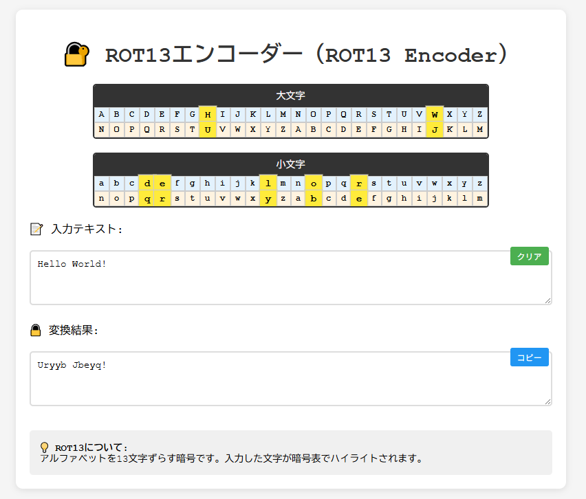

# ROT13エンコーダー（ROT13 Encoder）

🔐 **Day 5 - セキュリティツールをAIで作ってみよう 100日チャレンジ**

## 📋 プロジェクト概要

ROT13（Caesar cipher with shift 13）の動作原理を視覚的に学習できる教育用暗号ツールです。

古典暗号の入門として最適な換字式暗号であるROT13を、リアルタイム変換とインタラクティブな暗号表で体験できます。

## 🌐 デモページ

**📱 [https://ipusiron.github.io/rot13-encoder/](https://ipusiron.github.io/rot13-encoder/)**

## 📸 スクリーンショット

*ROT13エンコーダーの動作画面*

## 🎯 100日チャレンジについて

このツールは「**[「セキュリティツールをAIで作ってみよう 100日チャレンジ」プロジェクト](https://akademeia.info/?page_id=42163)**」の一環として、AI（Claude＋ChatGPT等）との協働で開発されました。

セキュリティ教育に役立つ実用的なツールを日々作成し、暗号技術やセキュリティの理解を深めることを目的としています。

## ✨ 主な機能

### 🔧 核心機能
- **リアルタイム変換**: 入力と同時にROT13変換を実行
- **視覚的暗号表**: 大文字・小文字の対応関係を一目で確認
- **インタラクティブハイライト**: 入力文字に対応する暗号表位置をリアルタイム表示
- **対称性の確認**: 同じ操作で暗号化・復号が可能

### 🛠️ ユーティリティ機能
- **クリアボタン**: 入力テキストの一括削除
- **コピーボタン**: 変換結果をワンクリックでクリップボードにコピー
- **レスポンシブデザイン**: PC・タブレット・スマートフォン対応

## 🚀 使い方

### 基本操作
1. **入力**: 上部のテキストエリアに変換したい文字を入力
2. **確認**: 暗号表で対応関係をハイライト表示で確認
3. **結果**: 下部のテキストエリアにROT13変換結果を表示

### 便利機能
- **クリア**: 緑色の「クリア」ボタンで入力をリセット
- **コピー**: 青色の「コピー」ボタンで変換結果をクリップボードへ

### 学習のヒント
- 身近な単語や文章で試してみましょう。
  - 例：「Security Akademeia」→「Frphevgl Nxnqrzvn」
- 同じテキストを2回変換すると元に戻ることを確認してください。
- 数字や記号は変換されないことを観察してください。

## 🔧 技術仕様

### 実装技術
- **フロントエンド**: HTML5, CSS3, Vanilla JavaScript
- **暗号化方式**: ROT13 (Caesar cipher, shift=13)
- **文字対応**: ASCII A-Z (65-90), a-z (97-122)
- **非対象文字**: 数字、記号、空白、日本語文字

### ブラウザ対応
- Chrome 80+
- Firefox 74+
- Safari 13+
- Edge 80+

## 📚 関連情報

### ROT13について
ROT13は**シフト暗号の鍵13（13文字ずらし）**と同等の、最も単純な換字式暗号の一つです。アルファベット26文字の半分（13）をシフトするため、同じ操作を2回行うと元の文字に戻る特性があります。この対称性により、暗号化と復号が同じアルゴリズムで実現できます。

### セキュリティ上の注意
**重要**: ROT13は教育目的の暗号であり、実際のセキュリティ用途には使用できません。現代の暗号化には適切な暗号化ライブラリを使用してください。

## 📄 ライセンス

このプロジェクトはMITライセンスの下で公開されています。
教育目的での自由な利用・改変・再配布が可能です。

---

**🔥 100日チャレンジ進行中！** セキュリティツール開発の旅を追いかけたい方は [@ipusiron](https://x.com/ipusiron) をフォローしてください。
